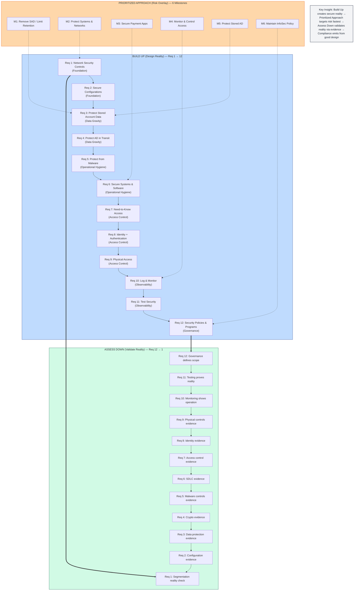

# Build Up, Assess Down

### A Dependency-Based Operating Model for PCI DSS Compliance

> **Core thesis:** When security controls are designed with dependency awareness and validated continuously, compliance becomes a byproduct of operational truth rather than a seasonal scramble for evidence.
> 

**Status:** Production-ready • v1.0 Titanium • Q1 2026 Beta Launch

[Read the Paper](#paper) • [Facilitator Guide](#workshop-materials) • [Field Kit](#field-kit) • [Citation](#citation)

---

## The Problem

Organizations subject to PCI DSS routinely experience three predictable surprises:

- **Scope expands late** in the assessment cycle
- **Data appears** in unexpected locations (logs, backups, queues, endpoints)
- **Evidence becomes archaeology** rather than operational output

These are not compliance failures—they are **design failures** that PCI DSS exposes.

---

## The Framework

**Build Up / Assess Down** reconciles three critical perspectives that are often misaligned:

### The Three-Lens Model



**Lens 1: Build Up (Design Reality)**

- Dependency order: PCI DSS Requirements 1 → 12
- Purpose: Create structural truth
- Owner mindset: Architects, engineers, platform owners
- Failure mode if skipped: Compensating controls + scope creep

**Lens 2: Prioritized Approach (Risk Overlay)**

- Unit of focus: 6 Council milestones
- Purpose: Allocate effort where risk reduction is highest
- Constraint: Never overrides dependencies
- Failure mode if misused: Siloed remediation ("milestone theater")

**Lens 3: Assess Down (Validate Reality)**

- Evidence order: PCI DSS Requirements 12 → 1
- Purpose: Confirm operational truth
- Owner mindset: Assessors, GRC, program owners
- Failure mode if ignored: Late discoveries, rework, mistrust

---

## Repository Structure

### Paper

Full academic treatment with literature review, methodology, three canonical failure modes, and practitioner validation.

| Document | Format | Purpose |
| --- | --- | --- |
| Academic Paper | [Markdown](paper/build-up-assess-down.md) / [PDF](paper/build-up-assess-down.pdf) | Formal framework documentation |

**Key sections:**

- Theoretical foundation (dependency stacks, compliance-as-exhaust hypothesis)
- Build Up model (Requirements 1→12 as architectural layers)
- Prioritized Approach reconciliation (risk overlay vs. implementation sequence)
- Assess Down validation flow (Requirements 12→1)
- Three canonical failure modes with root cause analysis
- Practitioner validation methodology
- Implications for PCI ecosystem

### Workshop Materials

Production-ready training curriculum for 90-minute flagship workshop.

| Artifact | Path | Description |
| --- | --- | --- |
| Facilitator Guide | [workshop/facilitator-guide.md](workshop/facilitator-guide.md) | Minute-by-minute delivery guide with exercises |
| Keynote Deck | [workshop/keynote-deck.md](workshop/keynote-deck.md) | 12-slide presentation with speaker script |
| Master Diagram | [workshop/slides/master-diagram.md](workshop/slides/master-diagram.md) | Three-lens reconciliation visual |
| Dependency Stack | [workshop/slides/dependency-stack.md](workshop/slides/dependency-stack.md) | Six-layer architecture diagram |

**Workshop flow:**

1. Problem diagnosis (15 min)
2. Build Up model (25 min)
3. Prioritized Approach reconciled (15 min)
4. Assess Down validation (20 min)
5. Compliance as exhaust payoff (15 min)

### Field Kit

Five practitioner templates validated through workshops with 90%+ recognition rate.

| Template | Path | Use Case |
| --- | --- | --- |
| 01: Dependency Map | [field-kit 01-dependency-map](./field-kit/field-kit.md#1-build-up-dependency-map) | Architecture review and design validation |
| 02: Evidence Storyboard | [field-kit 02-evidence-storyboard.md](./field-kit/field-kit.md#2-assess-down-evidence-storyboard) | Continuous evidence generation |
| 03: Remediation Ledger | [field-kit 03-remediation-ledger.md](./field-kit/field-kit.md#3-milestone-weighted-remediation-ledger) | Preventing milestone theater |
| 04: Advisor Questions | [field-kit 04-advisor-questions.md](./field-kit/field-kit.md#4-trusted-advisor-question-conversion-bank) | Shifting from compliance-checking to design-improving |
| 05: Failure Mode Library | [field-kit 05-failure-modes.md](./field-kit/field-kit.md#5-three-canonical-failure-modes-case-library) | Pattern recognition and prevention |

### Certification Program

Two-tier certification structure with beta launch strategy.

| Document | Path | Description |
| --- | --- | --- |
| Program Overview | [certification/program-overview.md](certification/program-overview.md) | Certification structure and requirements |
| Beta Logistics | [certification/beta-logistics.md](certification/beta-logistics.md) | Q1 2026 beta workshop delivery guide |

### Implementation

Operational roadmap for Q1 2026 launch.

| Document | Path | Description |
| --- | --- | --- |
| Q1 2026 Roadmap | [implementation/q1-2026-roadmap.md](./implementation/q1-2026-roadmap.md) | Four-phase execution plan |

### Visual Specifications

Design standards for diagrams and presentation materials.

| Document | Path | Description |
| --- | --- | --- |
| Design Standards | [visual-specs/design-standards.md](visual-specs/design-standards.md) | Color schemes, typography, diagram conventions |

---

## Quick Start

**New to the framework?**

- Start with the [Introduction](paper/build-up-assess-down.md#1-introduction) to understand the compliance paradox
- Read [Theoretical Foundation](paper/build-up-assess-down.md#2-theoretical-foundation) for the three-lens model

**Running a workshop?**

- Jump to the [Facilitator Guide](workshop/facilitator-guide.md) for minute-by-minute delivery
- Review [Keynote Deck](workshop/keynote-deck.md) for speaker notes

**Need templates now?**

- Browse the [Field Kit](field-kit/) for practitioner-ready templates
- Start with [01: Dependency Map](field-kit/01-dependency-map.md) for architecture review

**Planning certification?**

- Review [Program Overview](certification/program-overview.md) for structure
- Check [Beta Logistics](certification/beta-logistics.md) for Q1 2026 launch details

---

## The Mantra

> **Compliance is the exhaust. Security is the engine.**
> 

When organizations:

- **Build Up** with dependency awareness (foundational controls validated early)
- **Apply** the Prioritized Approach as a risk overlay (not implementation sequence)
- **Assess Down** continuously (evidence as system output)

Compliance becomes what it should always have been: **the natural exhaust from secure operations.**

---

## Three Canonical Failure Modes

The framework identifies three predictable patterns validated through practitioner workshops:

### 1. "We Did Milestone 1"

- **Scenario:** Data retention cleanup project completed, primary databases purged
- **Reality:** PAN persists in logs, backups, queues, analytics platforms
- **Root cause:** Tactical remediation without architectural reform (Req 1/3 dependencies ignored)
- **Prevention:** Validate data flows before claiming data minimization

### 2. "Segmentation Is a Diagram"

- **Scenario:** Clean network architecture documented, firewall rules reviewed
- **Reality:** Annual penetration test reveals flat network, 40+ systems suddenly in scope
- **Root cause:** Segmentation documented but never validated (Req 1 assumed, not tested)
- **Prevention:** Use Req 11 methods as design validation tools, not just compliance checkboxes

### 3. "Policies Before Reality"

- **Scenario:** Beautiful governance artifacts, documented risk assessments, mature Req 12
- **Reality:** Deployments bypass SDLC gates, monitoring alerts ignored, access reviews rubber-stamped
- **Root cause:** Started with governance (Req 12) instead of foundations (Req 1-6)
- **Prevention:** Build foundations first, use governance to codify what already works

**Common signature:** Dependency violation → Milestone theater → Late discovery via Assess Down → Rework cascade

---

## Council Compatibility

This framework does not replace PCI DSS or the Council's Prioritized Approach. It provides interpretive scaffolding that helps organizations design, operate, and validate controls more effectively.

**Alignment with PCI DSS v4.0.1:**

- Outcomes-based requirements (Build Up focuses on operational truth, not documentation)
- Continuous validation (Assess Down reframes evidence as system output)
- Customized approaches (Dependency awareness enables intelligent tailoring)
- Targeted risk analysis (Prioritized Approach reconciliation preserves risk-based effort allocation)
- Secure SDLC strengthening (Framework positions SDLC as "immune system")

---

## Validation Methodology

Framework validated through structured practitioner workshops:

**Format:**

- Duration: 90 minutes
- Participants: Security leaders, PCI program owners, QSAs/ISAs, architects
- Structure: Problem diagnosis → Model presentation → Failure mode analysis → Application exercises

**Results:**

- 90%+ problem resonance (participants immediately recognized the "three surprises")
- Consistent "aha" moments during reconciliation statement
- Immediate applicability (practitioners mapped pain points to dependency violations)
- Pattern recognition (milestone misinterpretation validated across workshops)

---

## Target Audiences

**Practitioners:**

- Security leaders and PCI program owners
- Architects and engineers supporting in-scope systems
- GRC/compliance teams managing assessment cycles

**Assessors:**

- QSAs (Qualified Security Assessors)
- ISAs (Internal Security Assessors)
- Consultants providing PCI advisory services

**Educators:**

- Training providers
- Conference speakers
- Internal security awareness teams

---

## Contributing

We welcome contributions that strengthen the framework while maintaining Council compatibility.

See [CONTRIBUTING.md](CONTRIBUTING.md) for:

- Case study submissions (additional failure modes)
- Workshop facilitation experiences
- Tool implementations
- Cross-framework applications (SOC 2, ISO 27001, NIST CSF)

---

## Citation

### APA Format

```jsx
Norton, S. (2025). Build Up, Assess Down: A Dependency-Based Operating Model 
for PCI DSS Compliance.
```

### BibTeX

```
@techreport{norton2025buildup,
  title={Build Up, Assess Down: A Dependency-Based Operating Model for PCI DSS Compliance},
  author={Norton, Scott},
  year={2025},
  version={1.0}
}
```

### Chicago Manual of Style

```jsx
Norton, Scott. 2025. "Build Up, Assess Down: A Dependency-Based Operating Model 
for PCI DSS Compliance."
```

---

## License

This framework is released under [Creative Commons Attribution 4.0 International (CC BY 4.0)](LICENSE).

You are free to:

- Share — copy and redistribute the material
- Adapt — remix, transform, and build upon the material for any purpose, including commercially

Under the following terms:

- Attribution — You must give appropriate credit, provide a link to the license, and indicate if changes were made

---

## Acknowledgments

This research was informed by practitioner workshops, assessor discussions, and real-world PCI DSS implementations across multiple industries. Special thanks to beta workshop participants for validation feedback.

---

## Contact

**Author:** Scott Norton

**Framework Version:** 1.0 (December 2025)

**For inquiries:**

- Workshop facilitation training
- Certification program details
- Conference presentations
- Advisory engagements

Please open a [GitHub Discussion](https://github.com/scottnorton-io/build-up-assess-down/discussions) or submit an issue.

---

## Version History

### v1.0 Titanium (December 2025)

- Initial release with complete framework documentation
- Academic paper (12,500 words, 35 pages formatted)
- Workshop materials (facilitator guide + keynote deck)
- Field kit (5 practitioner templates)
- Certification program structure
- Q1 2026 beta launch roadmap

---

**Status:** Production-ready • Q1 2026 Beta Launch • [View Roadmap](implementation/q1-2026-roadmap.md)
