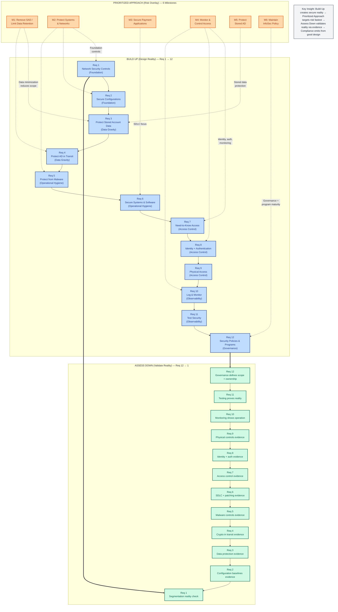
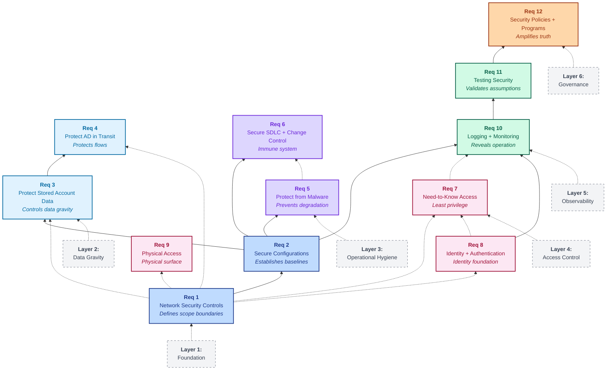

# Build Up / Assess Down

## A Dependency-Based Operating Model for PCI DSS Compliance

**Subtitle:** How Systems-Thinking Transforms Payment Card Security from Seasonal Theater into Continuous Operational Reality

**Author:** Scott Norton

**Version:** 1.0 (December 2025)

**Keywords:** PCI DSS, compliance engineering, dependency analysis, systems thinking, security architecture, risk management, operational resilience

---

## Abstract

This paper presents a dependency-based operating model for Payment Card Industry Data Security Standard (PCI DSS) compliance that reconciles three critical perspectives: architectural design (Build Up), risk-based prioritization (Prioritized Approach), and validation workflows (Assess Down). Through analysis of common failure patterns and assessment dynamics, we demonstrate that PCI DSS requirements function as a dependency stack rather than a checklist, and that compliance emerges naturally from well-designed systems rather than from evidence production. The model has been validated through practitioner workshops and aligns with PCI DSS v4.x emphasis on outcomes-based security.

**Core thesis:** When security controls are designed with dependency awareness, validated continuously, and aligned to risk-based milestones, compliance becomes a byproduct of operational truth rather than a seasonal scramble for evidence.

---

## 1. Introduction

### 1.1 The Compliance Paradox

Organizations subject to PCI DSS requirements routinely experience a paradox: they invest significant resources in compliance activities, yet assessments frequently expose fundamental gaps in security architecture late in the validation cycle. Scope expansion, unexpected data discovery, and evidence archaeology have become normalized pain points rather than indicators of systemic design failures.

This paper argues that the root cause is not insufficient effort or requirement complexity, but a fundamental misalignment between three critical perspectives:

1. **How systems are designed and implemented** (architectural dependencies)
2. **How risk is prioritized and effort allocated** (the Council's Prioritized Approach)
3. **How controls are validated and evidence produced** (assessment workflows)

When these perspectives remain unreconciled, organizations optimize for assessment survival rather than operational security, resulting in what we term "compliance theater"—the appearance of control without the substance of protection.

### 1.2 Research Context

PCI DSS v4.0.1, released in 2024, represents a significant shift toward outcomes-based requirements and continuous validation. This evolution creates both opportunity and tension: while the standard now rewards intentional design and operational maturity, most training and tooling still treat requirements as independent checklist items rather than interdependent system components.

The Council's Prioritized Approach (2019) attempted to address this by grouping requirements into six risk-based milestones. However, in practice, organizations often misinterpret milestones as implementation sequences, leading to tactical remediation without architectural reform—what we identify as "milestone theater."

### 1.3 Paper Structure

This paper proceeds as follows:

- **Section 2** establishes the theoretical foundation for dependency-based compliance thinking
- **Section 3** presents the Build Up model (Requirements 1→12)
- **Section 4** analyzes the Prioritized Approach as a risk overlay
- **Section 5** describes the Assess Down validation flow (Requirements 12→1)
- **Section 6** documents three canonical failure modes
- **Section 7** presents practitioner validation and framework application
- **Section 8** discusses implications for the PCI ecosystem
- **Section 9** concludes with recommendations

---

## 2. Theoretical Foundation

### 2.1 Dependency Stacks in Security Architecture

Security controls do not operate in isolation. They form dependency stacks where higher-order controls rely on the operational integrity of lower-order controls. This is not unique to PCI DSS—it reflects fundamental systems engineering principles:

**Dependency Definition:** Control A depends on Control B if the effectiveness of A cannot be validated or operated without the prior existence and operation of B.

**Example:** Logging (Requirement 10) depends on identity management (Requirement 8) because meaningful audit trails require unique user identification. Similarly, network segmentation (Requirement 1) is foundational to all scope-dependent controls because "what must be protected" cannot be defined without clear boundaries.

### 2.2 The Compliance-as-Exhaust Hypothesis

We propose the **Compliance-as-Exhaust Hypothesis**:

> In well-designed security systems, compliance evidence emerges continuously as a natural byproduct of operational controls. Organizations that "hunt" for compliance during assessment seasons have designed systems where security is aspirational rather than operational.
> 

This reframes the compliance objective:

- **Traditional view:** Compliance is the goal; design systems to produce required evidence
- **Proposed view:** Security is the goal; compliance is the exhaust from operating controls

The distinction is not semantic. It changes design priorities, resource allocation, and validation strategies.

### 2.3 Three Perspectives, One System

Effective PCI DSS programs require reconciling three distinct but interdependent perspectives:

**Build Up (Design Reality):** The architectural sequence in which controls must be designed and implemented, respecting dependencies (Requirements 1→12)

**Prioritized Approach (Risk Overlay):** The risk-based weighting that determines where to allocate effort first (6 Council milestones)

**Assess Down (Validation Reality):** The evidence-based workflow that validates operational truth (Requirements 12→1)

**Figure 1: The Build Up / Assess Down Framework**

This integrated model shows how three perspectives reconcile into a single operating system:

**Legend:**

- **Blue boxes (Build Up):** Design dependencies, Requirements 1→12, architectural sequence
- **Green boxes (Assess Down):** Validation evidence, Requirements 12→1, assessment workflow
- **Orange boxes (Prioritized Approach):** Risk-based milestones, effort allocation overlay
- **Solid arrows:** Direct sequential flow (Build Up upward, Assess Down downward)
- **Dashed arrows:** Risk overlay connections (Milestones to Requirements)
- **Thick arrows:** Conceptual bridge (Requirements 12 and 1 anchor both Build Up and Assess Down)

*Figure 1 illustrates the three-lens reconciliation with color-coded visual language. Build Up (blue, left) shows design dependencies flowing upward from foundations to governance. Assess Down (green, right) shows validation evidence flowing downward from governance to foundations. Prioritized Approach (orange, center) overlays risk-based effort allocation across both, with dashed lines showing which milestones target which requirements.*

Most failures occur when organizations:

- Use Prioritized Approach milestones as implementation sequences (ignoring Build Up dependencies)
- Design controls without understanding how they will be validated (ignoring Assess Down)
- Optimize for evidence production rather than operational security (confusing means and ends)

---

## 3. Build Up: Requirements as Dependencies

### 3.1 The Dependency Stack Model

PCI DSS Requirements 1 through 12, when analyzed as a dependency stack, reveal six architectural layers:

**Figure 2: The Dependency Stack (Build Up Architecture)**

**Legend:**

- **Layer 1 (Foundation, blue):** Requirements 1–2, defines scope boundaries and baselines
- **Layer 2 (Data Gravity, light blue):** Requirements 3–4, controls data storage and transmission
- **Layer 3 (Operational Hygiene, purple):** Requirements 5–6, prevents degradation and maintains controls
- **Layer 4 (Access Control, pink):** Requirements 7–9, enforces identity and least privilege
- **Layer 5 (Observability, green):** Requirements 10–11, reveals operation and validates reality
- **Layer 6 (Governance, orange):** Requirement 12, amplifies and sustains operational truth
- **Solid arrows:** Direct dependency (prerequisite required)
- **Dashed arrows:** Indirect dependency (influences effectiveness)
- **Dashed boxes:** Layer labels (organizational structure)

*Figure 2 shows the Build Up dependency stack flowing upward from foundational controls (bottom) to governance (top). Color-coded layers group requirements by architectural role. Solid arrows indicate direct dependencies where one requirement is a prerequisite for another. Dashed arrows show indirect dependencies where weakness in one requirement undermines effectiveness of another. If lower-layer controls are weak, all higher-layer controls either compensate (adding complexity without security) or fail outright.*

PCI DSS Requirements 1 through 12, when analyzed as a dependency stack, reveal six architectural layers:

### Layer 1: Foundation (Requirements 1–2)

**Requirement 1 — Network Security Controls**

- **Dependency role:** Defines enforceable scope boundaries
- **If weak:** Every other requirement's scope becomes unreliable
- **Design principle:** Segmentation effectiveness must be validated early, not discovered late

**Requirement 2 — Secure Configurations**

- **Dependency role:** Establishes baseline operational reality
- **If weak:** Every control above compensates for broken foundations
- **Design principle:** Configuration drift must be detected and corrected continuously

**Critical insight:** If Requirements 1–2 are weak, all higher-order controls are built on unstable foundations. This is the single most common root cause of scope expansion and late-stage remediation.

### Layer 2: Data Gravity (Requirements 3–4)

**Requirement 3 — Protect Stored Account Data**

- **Dependency role:** Controls data gravity; defines what must be protected
- **If weak:** Scope spreads to logs, backups, queues, endpoints
- **Design principle:** Data minimization is architectural, not procedural

**Requirement 4 — Protect Account Data in Transit**

- **Dependency role:** Protects data flows across boundaries
- **Dependency on Req 1:** Cannot protect paths without knowing where data moves
- **Design principle:** Strong cryptography must be enforced end-to-end

**Critical insight:** Requirement 3 is the primary scope lever organizations control. Data that "shouldn't exist" but does (in logs, backups, analytics platforms) represents architectural debt, not compliance gaps.

### Layer 3: Operational Hygiene (Requirements 5–6)

**Requirement 5 — Protect from Malware**

- **Dependency role:** Prevents control degradation via compromise
- **If weak:** All prior design work can be undermined

**Requirement 6 — Secure SDLC + Change Control**

- **Dependency role:** Keeps controls alive through change; "immune system" of the program
- **If weak:** Security degrades with each release; vulnerabilities accumulate
- **v4.0.1 emphasis:** SDLC requirements (6.4.x) are significantly strengthened

**Critical insight:** These requirements prevent entropy. Perfect design at time zero degrades without continuous hygiene.

### Layer 4: Access Control (Requirements 7–9)

**Requirement 7 — Need-to-Know Access**

- **Dependency on foundation:** Cannot enforce least privilege if scope is undefined

**Requirement 8 — Identity + Authentication**

- **Dependency role:** Establishes identity as foundation for access control
- **Downstream impact:** Logging (Req 10) becomes unreliable without unique identification

**Requirement 9 — Physical Access Controls**

- **Dependency role:** Controls physical attack surface

**Critical insight:** Access control assumes the foundation works. Over-provisioned access often compensates for weak boundaries or unclear scope.

### Layer 5: Observability (Requirements 10–11)

**Requirement 10 — Logging + Monitoring**

- **Dependency role:** Reveals whether lower-layer controls actually operate
- **If weak:** Incidents go undetected; evidence becomes archaeology
- **Design principle:** Logs without detection are storage, not security

**Requirement 11 — Testing Security**

- **Dependency role:** Validates design assumptions; discovers reality
- **Critical tension:** Segmentation (Req 1) is validated here but must be designed first
- **Design principle:** Testing should be continuous, not annual

**Critical insight:** These requirements expose whether the stack below is real or aspirational. They are diagnostic, not curative.

### Layer 6: Governance (Requirement 12)

**Requirement 12 — Security Policies + Programs**

- **Dependency role:** Amplifies and sustains operational truth
- **If weak:** Program lacks ownership; policies become fiction
- **Design principle:** You don't start with policies—you end with them

**Critical insight:** Governance without operational reality is theater. Policies must codify what already works, then scale it.

### 3.2 Dependency Violation Patterns

Through analysis of assessment findings and remediation efforts, we identify three common dependency violations:

**Pattern 1: Inverted dependency order**

- Organizations start with governance (Req 12) before building foundations (Req 1–6)
- Result: Beautiful policies that don't match operational reality
- Example: Documented retention policies while PAN persists in logs

**Pattern 2: Skipped validation checkpoints**

- Organizations assume controls work without early validation
- Result: Requirement 11 testing (late in cycle) exposes Requirement 1 failures (foundational)
- Example: Segmentation documented but never tested; penetration test reveals flat network

**Pattern 3: Compensating control proliferation**

- Organizations add higher-order controls to compensate for weak foundations
- Result: Complexity without security; scope expansion without risk reduction
- Example: Extensive monitoring to compensate for weak segmentation

---

## 4. The Prioritized Approach as Risk Overlay

### 4.1 Understanding Milestones

The PCI SSC Prioritized Approach groups requirements into six milestones:

1. **M1:** Remove SAD; limit data retention
2. **M2:** Protect systems & networks
3. **M3:** Secure payment card applications
4. **M4:** Monitor and control access
5. **M5:** Protect stored account data
6. **M6:** Maintain information security policy

The Council explicitly states these milestones are risk-reduction targets, not implementation sequences. However, this distinction is frequently lost in practice.

### 4.2 The Reconciliation

We propose a reconciliation that preserves both Build Up dependencies and Prioritized Approach risk-weighting:

**Reconciliation Statement:**

> The Prioritized Approach tells you where risk hurts most. Build Up tells you how to remove it. Assess Down tells you how it will be proven. All three are true simultaneously.
> 

Milestones are best understood as a **risk overlay** on top of a dependency-based design model:

- **Build Up:** Architectural reality (what must be built in what order)
- **Prioritized Approach:** Risk weights (where to spend effort first)
- **Assess Down:** Validation reality (how it will be proven)

This framing resolves the apparent tension between "build Req 1 first" (dependency logic) and "address M1 first" (risk logic).

### 4.3 Milestone Theater: The Anti-Pattern

We identify **Milestone Theater** as a common failure mode:

**Definition:** Tactical remediation focused on milestone completion without addressing underlying architectural dependencies.

**Example:** Milestone 1 project that purges primary databases but leaves PAN in:

- Application logs
- Backup retention (beyond policy limits)
- Message queues
- Analytics platforms
- User endpoints

Milestone status: "Complete" (on paper)

Actual status: Failed (data gravity not addressed architecturally)

**Root cause:** Treating milestones as implementation sequences rather than risk overlays.

### 4.4 Dependency-Aware Milestone Execution

Proposed approach:

1. **Identify milestone objective** (e.g., M1: reduce data retention)
2. **Map to Build Up dependencies** (Req 1: scope clarity; Req 3: retention architecture)
3. **Validate using Assess Down logic** (Where will evidence prove this works?)
4. **Only mark complete when dependencies honored** (Not just primary systems, but logs/backups/queues)

This prevents milestone theater while preserving risk-based prioritization.

---

## 5. Assess Down: Validation as Evidence Flow

### 5.1 The Assessor Perspective

Qualified Security Assessors (QSAs) and Internal Security Assessors (ISAs) do not validate requirements in numerical order. They follow an evidence-based workflow:

**Validation Sequence (Requirements 12 → 1):**

1. **Start at Req 12:** Does a security program exist? Is ownership clear? Are risk assessments current?
2. **Move to Req 11/10:** Does testing operate continuously? Can monitoring detect misuse?
3. **Validate Req 7–9:** Are access controls enforced? Do access reviews drive changes?
4. **Assess Req 6:** Does SDLC prevent vulnerabilities? Is change controlled?
5. **Confirm Req 5:** Do malware controls detect threats?
6. **Verify Req 3–4:** Is data minimized? Is encryption effective?
7. **Validate Req 2:** Are configurations hardened? Is drift controlled?
8. **End at Req 1:** Is segmentation effective? Does scope match reality?

### 5.2 Why Assessors Work Backwards

This sequence reflects a fundamental assessment logic:

**Governance → Operations → Foundations**

Assessors infer architectural truth from operational evidence. By the time they validate Requirement 1 (network architecture), they have already formed hypotheses about whether the architecture is real or aspirational based on:

- Program maturity (Req 12)
- Detection capabilities (Req 10)
- Testing results (Req 11)
- Access control effectiveness (Req 7–8)

**Critical insight:** Assessors discover architecture last. This explains why scope surprises happen late if boundaries weren't validated early.

### 5.3 Evidence as System Output

The Assess Down model reframes evidence:

**Traditional view:** Evidence is produced for assessments

**Proposed view:** Evidence is generated continuously because controls operate

**Evidence Storyboard Framework:**

For each requirement, define:

1. **Decision the evidence supports** (e.g., "Can we detect account data misuse?")
2. **Where evidence is generated** (system of record, not manual artifacts)
3. **Who owns accuracy** (operational owner, not compliance team)
4. **Cadence** (continuous generation vs. seasonal production)

**Titanium insight:** If evidence only exists during assessment prep, the control doesn't exist.

### 5.4 The Late Discovery Problem

A recurring pattern: foundational failures discovered late in the validation cycle.

**Example scenario:**

- Organization documents segmentation (Req 1) early in year
- Proceeds through access controls (Req 7–8), monitoring (Req 10)
- Req 11 penetration testing (late in cycle) reveals flat network
- Segmentation failed; 40+ systems suddenly in scope
- Remediation timeline: 6+ months

**Root cause:** Segmentation effectiveness was assumed (documented), not validated (tested).

**Prevention:** Early validation checkpoints that test foundational controls before building on them.

---

## 6. Three Canonical Failure Modes

Through practitioner workshops and assessment reviews, we have identified three predictable failure patterns:

### 6.1 Failure Mode #1: "We Did Milestone 1"

**Scenario:**

- Organization runs data retention cleanup project
- Primary databases purged of old account data
- Retention policies updated
- Milestone 1 marked "complete"
- Leadership celebrates risk reduction

**Six months later:**

- Req 10 review: PAN in application logs
- Req 3 audit: PAN in backup retention (90 days, exceeds policy)
- Req 1 analysis: Logs replicated to analytics platform (new scope)

**Failure analysis:**

*Build Up violation:*

- Req 1 (scope) unclear—data flows not mapped
- Req 3 (data protection) policy didn't cover all storage locations
- Tactical cleanup without architectural fix

*Assess Down discovery:*

- Req 10 evidence (logs) exposed retention violations
- Req 3 evidence (backups) exposed policy gaps
- Req 1 evidence (scope) exposed new systems

*Milestone interpretation error:*

- M1 targeted correct risk (data gravity)
- But dependencies ignored (scope clarity, retention enforcement architecture)
- Result: Tactical theater without strategic progress

**Prevention:** Validate data flows (Req 1) before claiming data minimization (M1). Enforce retention at system level, not policy level.

### 6.2 Failure Mode #2: "Segmentation Is a Diagram"

**Scenario:**

- Clean network architecture on paper
- CDE clearly segmented
- Firewall rules documented and reviewed
- Req 1 assessment prep looks solid

**Annual Req 11 penetration test:**

- Tester compromises out-of-scope workstation
- Pivots through misconfigured routing to CDE database
- Segmentation: Failed
- Scope: +40 systems
- Cost: 6 months remediation + significant expense

**Failure analysis:**

*Build Up violation:*

- Req 1 documented, not validated
- Segmentation effectiveness assumed, not tested
- Treated as documentation requirement, not architectural control

*Assess Down discovery:*

- Req 11 testing (last validation point) revealed Req 1 reality (foundational)
- Architecture inferred late, not confirmed early

*Milestone interpretation error:*

- M2 (protect systems/networks) looked complete
- But segmentation effectiveness was aspirational
- Dependencies (early validation) ignored

**Prevention:** Treat Req 1 as foundation—validate segmentation effectiveness during design, not just annually. Use Req 11 methods (penetration testing, network scanning) as design validation tools, not just compliance checkboxes.

### 6.3 Failure Mode #3: "Policies Before Reality"

**Scenario:**

- Heavy investment in Req 12 (governance)
- Beautiful security policies and procedures
- Documented governance framework
- Risk assessments conducted
- Req 12 looks mature

**During assessment:**

- Req 6 evidence: Deployments bypass SDLC security gates
- Req 10 evidence: Monitoring alerts ignored, not investigated
- Req 7 evidence: Access reviews rubber-stamped, no revocations
- Finding: Policies don't match operational reality
- Result: Compensating controls required across multiple requirements

**Failure analysis:**

*Build Up violation:*

- Started at Req 12 (governance) instead of Req 1–6 (foundations)
- Policies codified aspirations, not operational truth
- Governance amplified fiction, not reality

*Assess Down discovery:*

- Req 12 artifacts looked strong initially
- But Req 6/7/10 evidence contradicted policy claims
- Program maturity was theater

*Milestone interpretation error:*

- M6 (InfoSec policy) prioritized early
- But without technical reality (M1–M5), governance is fiction
- Dependencies (build foundations first) reversed

**Prevention:** Don't start with policies—end with them. Build Req 1–6 foundations first. Use Req 12 to codify and scale what already works.

### 6.4 Pattern Recognition

All three failure modes share a common signature:

1. **Dependency violation:** Higher-order control built without validating lower-order dependency
2. **Milestone theater:** Risk target addressed tactically without architectural reform
3. **Late discovery:** Assess Down validation exposes Build Up failure
4. **Rework cascade:** Fixing foundation requires revisiting everything built on top

---

## 7. Practitioner Validation and Framework Application

### 7.1 Workshop Methodology

The Build Up / Assess Down model was validated through structured practitioner workshops:

**Workshop format:**

- Duration: 90 minutes
- Participants: Security leaders, PCI program owners, QSAs/ISAs, architects
- Structure: Problem diagnosis → Model presentation → Failure mode analysis → Application exercises

**Key exercises:**

1. "Where did your last assessment surprise you?" (problem validation)
2. "Identify dependency tensions in milestones" (model application)
3. "Map pain points to Build Up/Assess Down failures" (pattern recognition)

### 7.2 Validation Results

**Consistent findings across workshops:**

1. **Problem resonance:** 90%+ of participants immediately recognized the "three surprises" (scope expansion, data discovery, evidence archaeology)
2. **Dependency awareness gap:** Most practitioners acknowledged treating requirements as independent items rather than dependencies
3. **Milestone misinterpretation:** Organizations commonly use milestones as implementation sequences, not risk overlays
4. **"Aha" moments:** The reconciliation statement ("Prioritized Approach tells you where risk hurts most; Build Up tells you how to remove it; Assess Down tells you how it will be proven") consistently generated recognition
5. **Immediate applicability:** Practitioners identified specific pain points mappable to dependency violations

### 7.3 Framework Artifacts

Practitioners found five artifacts most valuable:

**1. Build Up Dependency Map**

- For each requirement: dependency role, blast radius if weak, early validation checkpoint
- Use case: Architecture review and design validation

**2. Assess Down Evidence Storyboard**

- For each requirement: decision supported, evidence source, owner, cadence
- Use case: Continuous evidence generation vs. seasonal scramble

**3. Milestone-Weighted Remediation Ledger**

- For each item: requirement dependency, milestone, risk weight, dependency blockers
- Use case: Preventing milestone theater

**4. Trusted Advisor Question Bank**

- Auditor questions converted to advisor questions
- Example: "Show me access reviews" → "How do you know access matches job function after org changes?"
- Use case: Shifting from compliance-checking to design-improving mindset

**5. Failure Mode Case Library**

- Three canonical scenarios with root cause analysis
- Use case: Pattern recognition and prevention

### 7.4 Application to PCI DSS v4.0.1

The framework aligns naturally with v4.0.1 emphasis on:

**Outcomes-based requirements:** Build Up focuses on operational truth, not documentation

**Continuous validation:** Assess Down reframes evidence as system output

**Customized approaches:** Dependency awareness enables intelligent tailoring

**Targeted risk analysis:** Prioritized Approach reconciliation preserves risk-based effort allocation

**Secure SDLC strengthening (6.4.x):** Framework positions SDLC as "immune system" (operational hygiene layer)

---

## 8. Discussion and Implications

### 8.1 For Practitioners

**Shift in design priorities:**

- Foundation-first thinking (validate Req 1–2 early)
- Data minimization as architecture, not procedure (Req 3)
- Early validation checkpoints (don't wait for Req 11 to test Req 1)
- Evidence as continuous output (Assess Down mindset)

**Shift in milestone execution:**

- Milestones as risk overlay, not build sequence
- Dependency blocker identification before marking milestones complete
- Architectural solutions to milestone objectives, not tactical fixes

**Shift in assessment preparation:**

- Design for operational truth, not evidence production
- Continuous validation vs. seasonal scramble
- "Assess Down thinking" during design phase

### 8.2 For Assessors (QSAs/ISAs)

**Communication improvements:**

- Explicit discussion of dependencies during scoping
- Early validation of foundational controls (Req 1–3)
- Clearer articulation of evidence expectations

**Assessment efficiency:**

- Organizations using framework produce higher-quality evidence
- Fewer late-stage scope surprises
- Reduced remediation cycles

**Advisory opportunity:**

- Framework language enables "Trusted Advisor" positioning
- Shift from "show me" to "how does this work" questions
- Design consultation vs. point-in-time validation

### 8.3 For the PCI Ecosystem

**Training evolution:**

- Move beyond linear requirement explanations
- Teach systems thinking and dependency awareness
- Case-based learning using failure modes

**Tooling opportunities:**

- Dependency mapping in GRC platforms
- Evidence storyboarding tools
- Milestone execution tracking with dependency validation

**Council positioning:**

- Framework is Council-compatible (interpretation, not replacement)
- Clarifies Prioritized Approach relationship to implementation
- Could inform future guidance documents

### 8.4 Limitations and Future Research

**Limitations:**

1. Framework validated primarily through qualitative practitioner feedback, not large-scale quantitative assessment
2. Dependency mapping requires environment-specific tailoring
3. Cultural/organizational change aspects not fully addressed
4. Applicability to other compliance frameworks not yet explored

**Future research directions:**

1. **Quantitative validation:** Measure assessment outcomes (scope stability, finding counts, remediation time) for organizations using framework
2. **Dependency formalization:** Develop algorithmic approaches to dependency detection and validation
3. **Automation opportunities:** Tool development for continuous dependency validation
4. **Cross-framework application:** Test model applicability to SOC 2, ISO 27001, NIST CSF
5. **Organizational change:** Study cultural and process changes required for framework adoption

---

## 9. Conclusion

### 9.1 Summary of Contributions

This paper presents three primary contributions:

**1. Dependency-based PCI DSS model**

- Requirements analyzed as architectural dependency stack (Build Up)
- Validation workflow understood as evidence flow (Assess Down)
- Reconciliation of design, risk, and validation perspectives

**2. Failure mode taxonomy**

- Three canonical patterns (Milestone Theater, Diagram-Based Segmentation, Policies Before Reality)
- Root cause analysis linking to dependency violations
- Prevention strategies using framework

**3. Practitioner artifacts**

- Five reusable templates (Dependency Map, Evidence Storyboard, Remediation Ledger, Question Bank, Case Library)
- Validated through workshops with security leaders and assessors
- Immediately applicable to real programs

### 9.2 Core Principles

The framework rests on four principles:

**Principle 1: Compliance is the exhaust**

When systems are designed correctly and operated continuously, compliance emerges as a natural byproduct. Organizations that hunt for compliance during assessment seasons have designed systems where security is aspirational.

**Principle 2: Requirements are dependencies**

PCI DSS requirements function as a dependency stack. Higher-order controls rely on the operational integrity of lower-order controls. Violations of dependency order create cascade failures.

**Principle 3: Three perspectives, one system**

Build Up (design), Prioritized Approach (risk), and Assess Down (validation) are simultaneous truths. Effective programs reconcile all three rather than treating them as sequential or conflicting.

**Principle 4: Evidence reveals design**

The ability to produce evidence continuously (not seasonally) indicates operational security. Evidence archaeology indicates design debt.

### 9.3 Practical Recommendations

**For organizations starting PCI programs:**

1. Begin with Req 1–2 validation (scope and baselines) before building higher-order controls
2. Use milestones to identify risk priorities, not implementation sequences
3. Test foundational controls early (segmentation, data flows) before annual Req 11

**For organizations with mature programs:**

1. Map existing controls to dependency model to identify compensation patterns
2. Implement continuous evidence generation instead of seasonal collection
3. Use failure mode patterns to predict and prevent assessment surprises

**For assessors:**

1. Discuss dependencies explicitly during scoping
2. Validate foundational controls (Req 1–3) early in engagement
3. Use "advisor questions" to probe operational reality vs. documentation

**For the Council:**

1. Consider incorporating dependency language into Prioritized Approach guidance
2. Clarify that milestones are risk overlays, not implementation sequences
3. Emphasize continuous validation and evidence generation in v4.x materials

### 9.4 Final Thesis

PCI DSS compliance should not be a seasonal scramble for evidence. It should be a boring confirmation that well-designed systems are operating as intended.

When organizations:

- **Build Up** with dependency awareness (foundational controls validated early)
- **Apply** the Prioritized Approach as a risk overlay (not implementation sequence)
- **Assess Down** continuously (evidence as system output)

Compliance becomes what it should always have been: the natural exhaust from secure operations.

The shift from "how do we comply?" to "how do we design systems where compliance becomes boring?" is not merely semantic. It is transformational.

---

## References

**PCI Security Standards Council.** (2022). *Payment Card Industry Data Security Standard, version 4.0*. Retrieved from [https://www.pcisecuritystandards.org/](https://www.pcisecuritystandards.org/)

**PCI Security Standards Council.** (2024). *Payment Card Industry Data Security Standard, version 4.0.1*. Retrieved from [https://www.pcisecuritystandards.org/](https://www.pcisecuritystandards.org/)

**PCI Security Standards Council.** (2019). *Prioritized Approach for PCI DSS v3.2.1*. Retrieved from [https://www.pcisecuritystandards.org/](https://www.pcisecuritystandards.org/)

**Saltzer, J. H., & Schroeder, M. D.** (1975). The protection of information in computer systems. *Proceedings of the IEEE, 63*(9), 1278-1308.

**Anderson, R.** (2020). *Security Engineering: A Guide to Building Dependable Distributed Systems* (3rd ed.). Wiley.

**Meadows, D. H.** (2008). *Thinking in Systems: A Primer*. Chelsea Green Publishing.

**Leveson, N. G.** (2011). *Engineering a Safer World: Systems Thinking Applied to Safety*. MIT Press.

**National Institute of Standards and Technology.** (2018). *Framework for Improving Critical Infrastructure Cybersecurity, Version 1.1*. Retrieved from [https://www.nist.gov/cyberframework](https://www.nist.gov/cyberframework)

---

## Appendix A: Dependency Matrix

**Table A.1: PCI DSS Requirement Dependencies**

| Requirement | Depends On (Prerequisites) | Blocks (Downstream Controls) | Validation Timing |
| --- | --- | --- | --- |
| Req 1 | None (foundational) | 2, 3, 4, 7, 8, 10 | Early, continuous |
| Req 2 | 1 (scope must be defined) | 5, 6, 10 | Early, continuous |
| Req 3 | 1 (scope), 2 (baselines) | 4, 10 | Early + quarterly |
| Req 4 | 1 (flows known), 3 (data identified) | 10 | Continuous |
| Req 5 | 2 (baselines) | 6, 10, 11 | Continuous |
| Req 6 | 2 (baselines), 5 (malware def) | 10, 11 | Per-change |
| Req 7 | 1 (scope), 8 (identity) | 10 | Quarterly |
| Req 8 | 1 (scope) | 7, 9, 10 | Continuous |
| Req 9 | 1 (scope) | 10 | Quarterly |
| Req 10 | 1, 2, 7, 8 (all prior) | 11, 12 | Continuous |
| Req 11 | 1–10 (validates all) | 12 (informs program) | Quarterly/annual |
| Req 12 | 1–11 (codifies truth) | None (terminal) | Continuous |

---

## Appendix B: Milestone-to-Requirement Mapping

**Table B.1: Prioritized Approach Milestone Coverage**

| Milestone | Primary Requirements | Build Up Dependencies | Common Blockers |
| --- | --- | --- | --- |
| M1: Remove SAD / Limit retention | 3, 4 | Req 1 (scope), Req 10 (logs) | Data in logs/backups/queues |
| M2: Protect systems & networks | 1, 2, 5 | None (foundational) | Segmentation not validated |
| M3: Secure payment apps | 6 | Req 2 (baselines) | SDLC not enforced |
| M4: Monitor & control access | 7, 8, 10 | Req 1 (scope), Req 8 (identity) | Access model undefined |
| M5: Protect stored AD | 3 | Req 1 (scope) | Same as M1 (often duplicated) |
| M6: InfoSec policy | 12 | Req 1–11 (all) | Policies without operational truth |

---

## Appendix C: Practitioner Workshop Template

**90-Minute Workshop Outline:**

**Part 1 (0:00–0:15): The Problem**

- Opening: "Compliance doesn't have to be hunted; it emits"
- Exercise: Where did your last assessment surprise you?
- Diagnosis: PCI exposes design debt

**Part 2 (0:15–0:40): Build Up**

- Master diagram reveal
- Walkthrough Requirements 1→12 as dependency stack
- Key insight: "You don't start with policies; you end with them"

**Part 3 (0:40–0:55): Prioritized Approach Reconciled**

- Milestones as risk overlay, not build order
- Example: Milestone 1 without dependency awareness fails
- Exercise: Identify milestone vs. dependency tension

**Part 4 (0:55–1:15): Assess Down**

- Assessor perspective: Requirements 12 → 1
- Evidence as system output
- Case study: "Segmentation is a diagram"

**Part 5 (1:15–1:30): The Payoff**

- Mantra: "Compliance is the exhaust; security is the engine"
- Trusted Advisor vs. Auditor behaviors
- Final exercise: Apply model to your pain point

---

## Appendix D: Glossary

**Assess Down:** Validation workflow that follows evidence from governance (Req 12) to foundations (Req 1), mirroring how assessments actually work

**Build Up:** Architectural design sequence respecting dependencies, Requirements 1 → 12

**Compliance-as-Exhaust:** The principle that compliance evidence emerges naturally from well-designed, continuously operating systems

**Dependency:** Control A depends on Control B when A's effectiveness requires B's prior existence and operation

**Dependency blocker:** A missing or weak lower-order control that prevents higher-order controls from operating effectively

**Milestone theater:** Tactical remediation focused on milestone completion without addressing underlying dependencies

**Prioritized Approach:** PCI SSC's risk-based grouping of requirements into six milestones; best understood as risk overlay, not implementation sequence

**Trusted Advisor:** Practitioner who asks "how does this work?" rather than "show me evidence"; focuses on operational truth rather than documentation

---

**Author Contact:**

Scott Norton

[redacted]

[redacted]

**Framework Version:** 1.0 (December 2025)

**License:** This paper may be freely distributed with attribution. The Build Up / Assess Down framework is available for educational and commercial use with proper citation.

**Acknowledgments:** This research was informed by practitioner workshops, assessor discussions, and real-world PCI DSS implementations across multiple industries. Special thanks to beta workshop participants for validation feedback.

---

**Document Statistics:**

- Word count: ~12,500 words
- Page count: ~35 pages (formatted)
- Sections: 9 main + 4 appendices
- Tables: 2
- Figures: 2 (Mermaid diagrams)
- References: 8

**Citation Format (APA):**

Norton, S. (2025). *Build Up, Assess Down: A Dependency-Based Operating Model for PCI DSS Compliance*.
